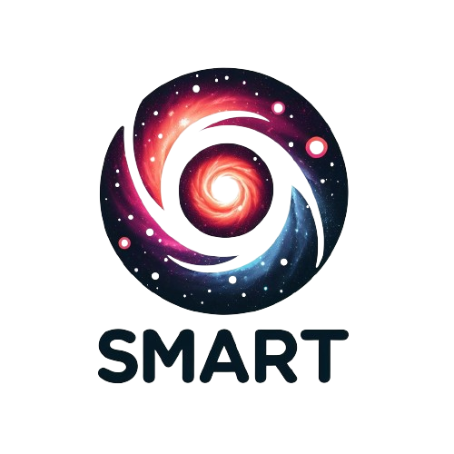
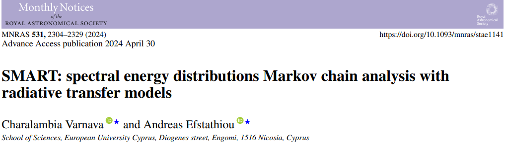

  

 <b>SMART</b> (<b>S</b>pectral energy distributions <b>M</b>arkov chain <b>A</b>nalysis with <b>R</b>adiative <b>T</b>ransfer models) is a publicly available open-source spectral energy distribution (SED) fitting code. Implementing a Bayesian Markov chain Monte Carlo (MCMC) method, <b>SMART</b> fits the ultraviolet to millimetre SEDs of galaxies exclusively with radiative transfer models that currently constitute four types of pre-computed libraries, which describe the starburst, active galactic nucleus (AGN) torus, host galaxy and polar dust components. <b>SMART</b> promises to be a useful tool for studying galaxy evolution in the <i>JWST</i> era. The code is developed in <b>PYTHON 3.10</b> (Anaconda package). 

 To start using <b>SMART</b>, please select your operating system below and then download () the folder and extract its contents. 

 &thinsp;  &thinsp;  

 
 

  

 
 

 &thinsp; 
  

 

Documentation
=============

 To learn how to run <b>SMART</b> and for a helpful user guide, please read the <a href="https://github.com/ch-var/SMART/blob/main/assets/SMART_User_Manual.pdf">manual</a>. 

  

Having issues?
=============

 If you are experiencing any problems using <b>SMART</b>, do not hesitate to contact us at <a href="mailto:varnava.haris@gmail.com">varnava.haris@gmail.com</a> or <a href="mailto:a.efstathiou@euc.ac.cy">a.efstathiou@euc.ac.cy</a>. 

 

Attribution
=============

 If you find this tool useful in your research, please cite <a href="https://academic.oup.com/mnras/advance-article/doi/10.1093/mnras/stae1141/7660585">Varnava & Efstathiou (2024a)</a> and <a href="https://www.ascl.net/2406.003">Varnava & Efstathiou (2024b)</a>. 

 
 The BibTeX entry for the paper is: 

    @article{2024MNRAS.tmp.1161V,
       author = {{Varnava}, C. and {Efstathiou}, A.},
        title = {SMART: Spectral energy distributions Markov chain Analysis with Radiative Transfer models},
      journal = {MNRAS},
         year = 2024,
       volume = 531,
        pages = {2304–2329},
       eprint = {2405.18130},
          doi = {10.1093/mnras/stae1141}
    }

The BibTeX entry for the code is:

    @software{2024ascl.soft06003V,
       author = {{Varnava}, Charalambia and {Efstathiou}, Andreas},
        title = "{SMART: Spectral energy distribution (SED) fitter}",
      howpublished = {Astrophysics Source Code Library, record ascl:2406.003},
         year = 2024,
       eid = {ascl:2406.003},
    }
   
 

Presentation
=============

 To learn more about <b>SMART</b>, please read a useful <a href="https://github.com/ch-var/SMART/blob/main/assets/Presentation_GitHub.pdf">presentation</a>. 

License
=======

 Copyright 2024 Charalambia Varnava and contributors 

 <b>SMART</b> is a free tool made available under the terms of the MIT License. For details see the <a href="https://github.com/ch-var/SMART/blob/main/LICENSE">LICENSE file</a>. 

